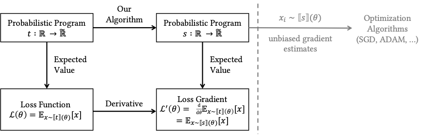
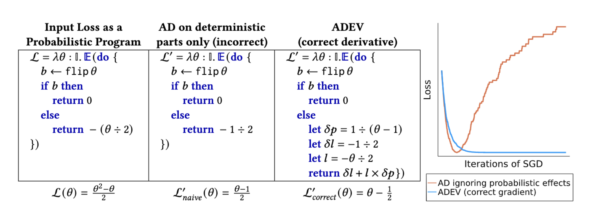

# ADEV

This repository contains the Haskell prototype that accompanies the paper "[ADEV: Sound Automatic Differentiation of Expected Values of Probabilistic Programs](https://popl23.sigplan.org/details/POPL-2023-popl-research-papers/5/ADEV-Sound-Automatic-Differentiation-of-Expected-Values-of-Probabilistic-Programs)".

## Overview


ADEV is a method of automatically differentiating loss functions defined as *expected values* of probabilistic processes. ADEV users define a _probabilistic program_ $t$, which, given a parameter of type $\mathbb{R}$ (or a subtype), outputs a value of type $\widetilde{\mathbb{R}}$,
which represents probabilistic estimators of losses. We translate $t$ to a new probabilistic program $s$,
whose expected return value is the derivative of $t$’s expected return value. Running $s$ yields provably unbiased
estimates $x_i$ of the loss's derivative, which can be used in the inner loop of stochastic optimization algorithms like ADAM or stochastic gradient descent.

ADEV goes beyond standard AD by explicitly supporting probabilistic primitives, like `flip`, for flipping a coin. If these probabilistic constructs are ignored, standard AD may produce incorrect results, as this figure from our paper illustrates:

In this example, standard AD
fails to account for the parameter $\theta$'s effect on the *probability* of entering each branch. ADEV, by contrast, correctly accounts
for the probabilistic effects, generating similar code to what a practitioner might hand-derive. Correct
gradients are often crucial for downstream applications, e.g. optimization via stochastic gradient descent.

ADEV compositionally supports various gradient estimation strategies from the literature, including:
- Reparameterization trick (Kingma & Welling 2014)
- Score function estimator (Ranganath et al. 2014)
- Baselines as control variates (Mnih and Gregor 2014)
- Multi-sample estimators that Storchastic supports (e.g. leave-one-out baselines) (van Krieken et al. 2021)
- Variance reduction via dependency tracking (Schulman et al. 2015)
- Special estimators for differentiable particle filtering (Ścibior et al. 2021)
- Implicit reparameterization (Figurnov et al. 2018)
- Measure-valued derivatives (Heidergott and Vázquez-Abad 2000)
- Reparameterized rejection sampling (Nasseth et al. 2017)


## Haskell Example

ADEV extends forward-mode automatic differentiation to support  *probabilistic programs*. Consider the following example:

```haskell
import Numeric.ADEV.Class (ADEV(..))
import Numeric.ADEV.Interp ()
import Numeric.ADEV.Diff (diff)
import Control.Monad (replicateM)
import Control.Monad.Bayes.Sampler.Strict (sampleIO)

-- Define a loss function l as the expected
-- value of a probabilistic process.
l theta = expect $ do
    b <- flip_reinforce theta
    if b then
        return 0
    else
        return (-theta / 2)

-- Take its derivative.
l' = diff l

-- Helper function for computing averages
mean xs = sum xs / (realToFrac $ length xs)

-- Estimating the loss and its derivative 
-- by averaging many samples
estimate_loss  = fmap mean (replicateM 1000 (l 0.4))
estimate_deriv = fmap mean (replicateM 1000 (l' 0.4))

main = do
    loss  <- sampleIO estimate_loss
    deriv <- sampleIO estimate_deriv
    print (loss, deriv)
```

**Defining a loss.** The function `l` is defined to be the *expected value* of a probabilistic process, using `expect`. The process in question involves flipping a coin, whose probability of heads is `theta`, and returning either `0` or `-theta / 2`, depending on the coin flip's result.

**Differentiating.** ADEV's `diff` operator converts such a loss into a new function `l'` representing its derivative, with respect to the input parameter `theta`.

**Running the estimators.** Operationally, neither `l` nor `l'` compute exact expectations (or derivatives of expecations): instead, they represent _unbiased estimators_ of the desired values, which can be run using `sampleIO`.
On one run, the above code printed `(-0.122, -0.10)`, which are very close to the correct values of $-0.12$ and $-0.1$. 

**Composing `expect` with other operators.** Note that ADEV also provides primitives for manipulating expected values, e.g. `exp_` for taking their exponents. For example, the code `fmap mean (replicateM 1000 (exp_ (l 0.4)))` yielded `0.881` on a sample run, close to the true value of $e^{-0.12} = 0.886$. This is the exponent of the expected value, not the expected value of the exponent, which is slightly different, and would yield $0.6 \times e^{-0.2} + 0.4 \times e^0 = 0.891$.

**Optimization.** We can use ADEV's estimated derivatives to implement a stochastic optimization algorithm:

```haskell
sgd loss eta x0 steps = 
    if steps == 0 then
        return [x0]
    else do
        v <- diff loss x0
        let x1 = x0 - eta * v
        xs <- sgd loss eta x1 (steps - 1)
        return (x0:xs)
```

Running `sampleIO $ sgd l 0.2 0.2 100` finds the  value of $\theta$ that minimizes $l$, namely $\theta = 0.5$.

## Haskell Encoding of ADEV Programs

In the ADEV paper, the program `l` above would have type $\mathbb{R} \to \widetilde{\mathbb{R}}$. 
In Haskell, its type is `ADEV p m r => r -> m r`. Why?

In general, expressions in the ADEV source language are represented by Haskell expressions with polymorphic type `ADEV p m r => ...`, where the `...` is a Haskell type that uses the three type variables `p`, `m`, and `r` as follows:

* `r` represents real numbers, $\mathbb{R}$ in the ADEV paper. (The type of positive reals reals, $\mathbb{R}_{>0}$, is represented as `Log r`.)
* `m r` represents estimated real numbers, $\widetilde{\mathbb{R}}$ in the ADEV paper.
* `p m a` represents probabilistic programs returning `a`, $P~a$ in the ADEV paper.

Below, we show how `l`'s type relates to the types of its sub-expressions: 
```haskell
-- `flip_reinforce` takes a real parameter and 
-- probabilistically outputs a Boolean.
flip_reinforce :: ADEV p m r => r -> p m Bool

-- Using `do`, we can build a larger computation that
-- uses the result of a flip to compute a real.
-- Its type reflects that it still takes a real parameter
-- as input, but now probabilistically outputs a real.
prog :: ADEV p m r => r -> p m r
prog theta = do 
  b <- flip_reinforce theta 
  if b then 
    return 0 
  else 
    return (-theta/2)

-- The `expect` operation turns a probabilistic computation
-- over reals (type P R) into an estimator of its expected
-- value (type R~).
expect :: ADEV p m r => p m r -> m r

-- By composing expect and prog, we get l from above.
l :: ADEV p m r => r -> m r
l = expect . prog
``` 

## Implementation

To understand ADEV's implementation, it is useful to first skim the ADEV paper, which explains how ADEV modularly extends standard forward-mode AD with support for probabilistic primitives. The Haskell code is a relatively direct encoding of the ideas described in the paper. Briefly:

* All the primitives in the ADEV language, including those introduced by the extensions from Appendix B, are encoded as methods of the `ADEV` typeclass, in the [Numeric.ADEV.Class](src/Numeric/ADEV/Class.hs) module. This is like a 'specification' that a specific interpreter of the ADEV language can satisfy. It leaves open what concrete Haskell types will be used to represent the ADEV types of real numbers $\mathbb{R}$, estimated reals $\widetilde{\mathbb{R}}$, and monadic probabilistic programs $P~\tau$ — it uses the type variables `r`, `m r`, and `p m tau` for this purpose.

* The [Numeric.ADEV.Interp](src/Numeric/ADEV/Interp.hs) module provides one instance of the `ADEV` typeclass, implementing the standard semantics of an ADEV term. The type variables `p`, `m`, and `r` are instantiated so that the type of reals `r` is interpreted as `Double`, the type `m r` of *estimated* reals is interpreted as the type `m Double` for some `MonadDistribution` `m` (where `MonadDistribution` is the [monad-bayes](https://github.com/tweag/monad-bayes) typeclass for probabilistic programs), and the type of probabilistic programs `p m a` is interpreted as `WriterT Sum m a` (the `Sum` maintains an accumulated loss, and is described in Appendix B.2 of the ADEV paper).

* The [Numeric.ADEV.Diff](src/Numeric/ADEV/Diff.hs) module provides built-in derivatives for each primitive. These are organized into a second instance of the `ADEV` typeclass, where now the type `r` of reals is interpreted as `ForwardDouble`, representing forward-mode dual numbers $\mathcal{D}\\{\mathbb{R}\\}$ from the paper; the type `m r` of estimated reals is interpreted as the type `m ForwardDouble` for some `MonadDistribution` `m`, which implements the type $\widetilde{\mathbb{R}}\_\mathcal{D}$ of estimated dual numbers from the paper; and the type `p m tau` of probabilistic programs is interpreted as `ContT ForwardDouble m tau`, i.e., the type of *higher-order functions* that transform an input `loss_to_go : tau -> m ForwardDouble` into an estimated dual-number loss of type `m ForwardDouble` (this implements the type $P\_\mathcal{D}~\tau$ from the paper).


## Installing ADEV
1. Install `stack` (https://docs.haskellstack.org/en/stable/install_and_upgrade/).
2. Clone this repository.
3. Run the examples using `stack run ExampleName`, where `ExampleName.hs` is the name of a file from the `examples` directory.
4. Or: Run `stack ghci` to enter a REPL.
